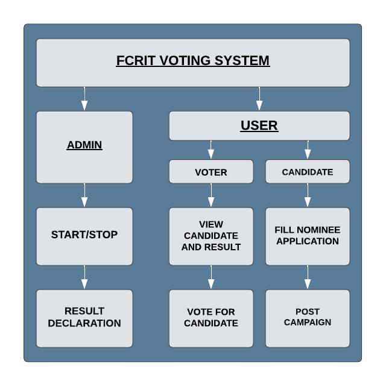
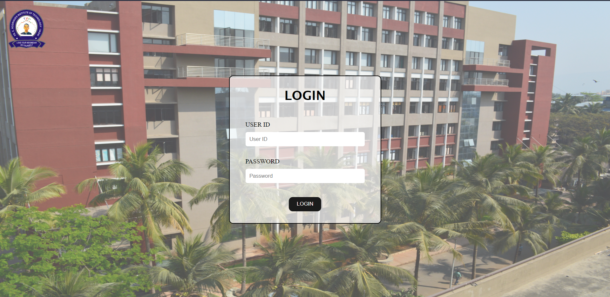
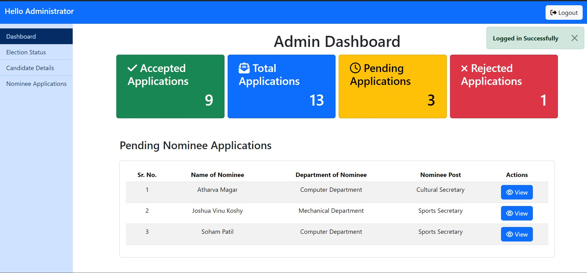
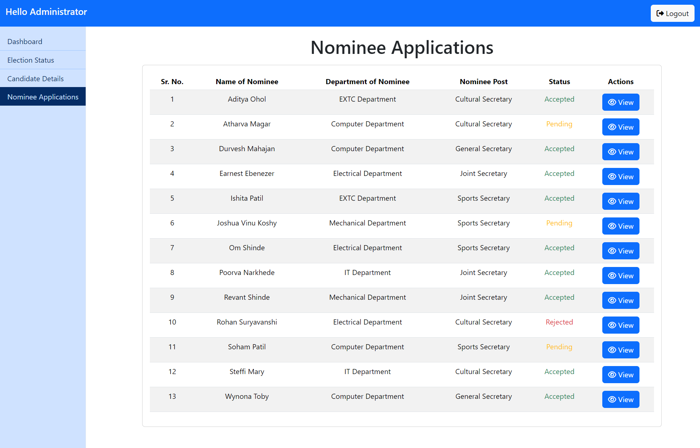
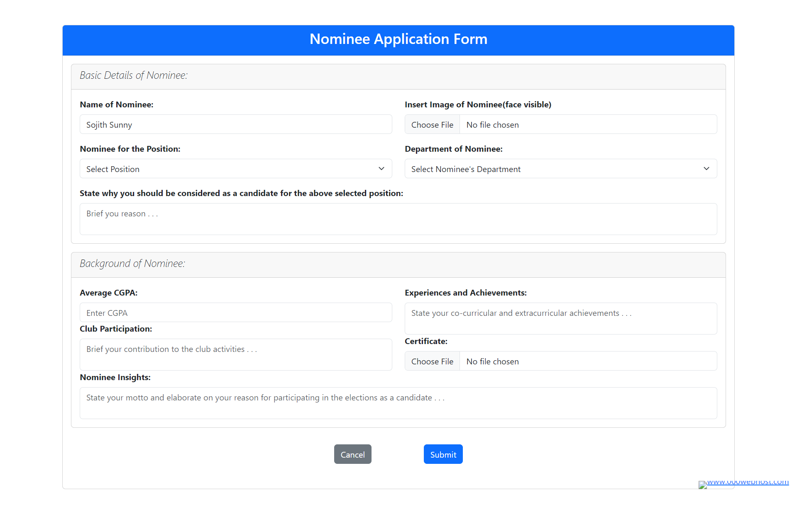
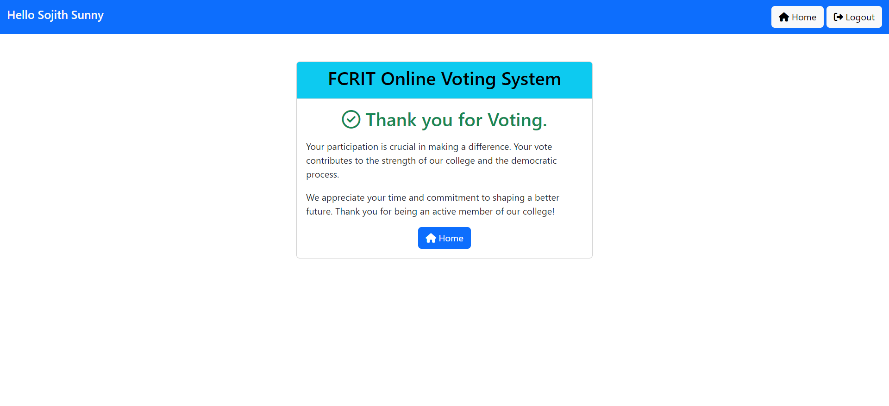

# [FCRIT Voting System](https://semp2324.000webhostapp.com/)

This is a PHP-based online voting system for FCRIT. It allows candidates to register and voters to cast their votes. The system also provides a dashboard for administrators to manage the voting process.



## Prerequisites

To run this application, you will need the following:

* PHP 7.4 or later
* MySQL database
* Composer

## Installation

1. Clone the repository to your local machine.
2. Run `composer install` to install the dependencies.
3. Create a `.env` file and add the following details:

```
DB_HOST=localhost
DB_USER=root
DB_PASS=
DB_NAME=voting_system
```

4. Create the database and import the `voting_system.sql` file.
5. Run `php artisan migrate` to create the database tables.
6. Run `php artisan serve` to start the development server.

## Usage

To use the application, simply visit `http://localhost:8000` in your browser. You will be able to register as a candidate or voter, and cast your vote.

## Features

The application has the following features:

* Candidate registration
* Voter registration
* Voting
* Dashboard for administrators

## Screenshots

### User Login Page

### Administrator Dashboard




### Candidate Application Form


### Voter Dashboard



## Documents

### [Project Report](docs/MINI-PROJECT%20REPORT%20FINAL.pdf)
### [Technical Paper](docs/Technical%20Paper.pdf)

## Publication Details
### Paper ID: IJRPR-79553
### Paper Title: "FCRIT's Online Voting System"
### [Published Article](https://ijrpr.com/uploads/V5ISSUE5/IJRPR27141.pdf)

### Certificate of Publication:


## Conclusion

This is a simple and easy-to-use online voting system that can be used for various purposes. It is secure, reliable, and scalable.
